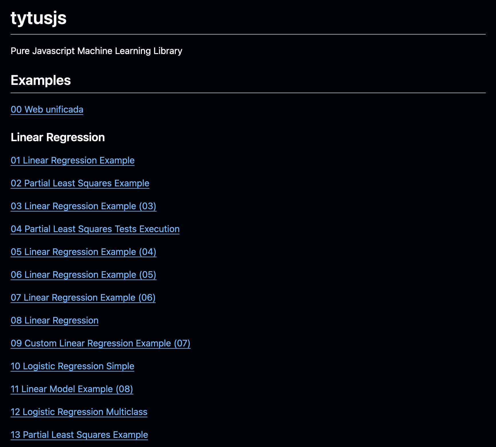
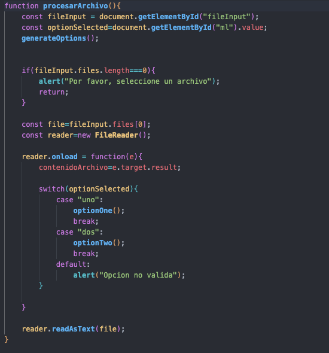
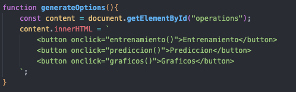
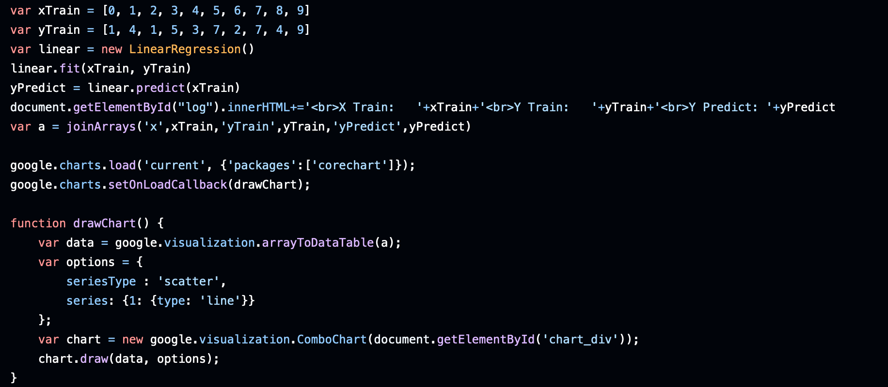

### UNIVERSIDAD SAN CARLOS DE GUATEMALA

### FACULTAD DE INGENIERIA

### ESCUELA DE CIENCIAS Y SISTEMAS

### INTELIGENCIA ARTIFICIAL 1

### MANUAL TECNICO

- CARLOS AUGUSTO HERNANDEZ ORDOÑEZ - 201611269

## Indice
### Introducción
### Objetivos
### Lenguajes
### Tytus
### Problema
### Solución
### Conclusiones
### Recomendaciones
### Referencias

# INTRODUCCIÓN

Este proyecto tiene como objetivo crear un sitio web interactivo que permita a los usuarios practicar y experimentar con algoritmos de Machine Learning, mediante la selección de archivos de entrada y modelos de aprendizaje automático. Se ha diseñado usando HTML y JavaScript, con la ayuda de GitHub Pages para su despliegue. Utilizando la biblioteca **tytus.js**, el sitio permite a los usuarios ajustar parámetros de los modelos, entrenarlos con diferentes conjuntos de datos, y observar los resultados de predicción en tiempo real.

# Objetivos

Aplicando los conocimientos adquiridos a nivel teorico, a través de una librería que cumple con los requisitos y simplemente con uso de esas herramientas poder mostrar la información correspondiente. Teniendo en caso elementos fijos.

## Objetivos especificos

- Implementar una interfaz web que permita la selección de archivos de datos en formato CSV y de diferentes modelos de Machine Learning.
- Facilitar la parametrización de modelos mediante controles intuitivos para ajustar el porcentaje de datos de entrenamiento y prueba, definir el objetivo de entrenamiento, y establecer parámetros específicos para cada tipo de modelo.
- Proveer herramientas de visualización para mostrar resultados de entrenamiento y predicción, así como gráficos que faciliten la interpretación de los datos y del modelo.
- Promover el aprendizaje de conceptos de Machine Learning a través de una plataforma accesible que utiliza tecnologías web como GitHub Pages, JavaScript y HTML.

# Lenguajes

En el mundo actual existen muchos frameworks que  nos permite que podamos construir muchos proyectos con pasos muy sencillos sin embargo en esta ocasión, el proyecto requiere que realicemos la funcionalidad de la manera más sencilla que sea posible a través del uso de la librería ya mencionada por lo que es necesario tener a la mano la menor complejidad posible para que la funcionalidad de este correcta al 100%

Por lo que la utilización del proyecto de tutys es perfecto para aplicaciones de este tipo donde efectuamos la efectividad de algoritmos con diferentes tipos de actividades.

# Tytus

es una librería realizada por compañeros de la USAC utilizado con aprendizaje de creación de forma práctica el proyecto de los conocimientos teoricos de lo elementos especificos, cumpliendo con los puntos anteriores se tiene lo siguiente.

Con HTML y utilización de algunos algoritmos de Javascript es posible crear y aplicar de manera sencilla la utilización de librería de los elementos

Las herramientas a desarrollar serán las siguientes

# Javascript
Contamos con una función principal que utiliza de manera básica la elección de elementos a elejir

Esta función se encarga de:

- Obtener elementos del DOM: Busca en el documento HTML los elementos con los ID "fileInput" y "ml". El primero es probablemente un input de tipo file donde el usuario selecciona un archivo, y el segundo podría ser un selector o menú donde se elige una opción.
- Verificar si se seleccionó un archivo: Si no se ha seleccionado ningún archivo, muestra una alerta y termina la función.
- Leer el archivo: Crea un objeto FileReader para leer el contenido del archivo seleccionado. Una vez que la lectura se completa, asigna el contenido a la variable contenidoArchivo.
- Ejecutar una acción según la opción seleccionada: Utiliza un switch para determinar qué función ejecutar (optionOne() o optionTwo()) en base al valor seleccionado en el elemento "ml". Si la opción no es válida, muestra una alerta.

En cuestiones ténicas tenemos opciones que se muestran en el DOM cuando es competente, y con ello pueda tener fluidez el sistema con elementos que deben mostrarse

# problema

la solución del inconveniente con ello sigue los estándares de los puntos especificos, con ello se puede realizar una aplicación por momentos de utilización especifica, queremos tomar en consideración elementos y en base a los resultados obtiene la información correcta

# solución

ejemplificando una manera sencilla los elementos

Con ello obtenemos un resultado proveniente de la información a la cual nos estamos refieriendo y conseguimos con ello un punto de estrategia elementa.

# Conclusiones

  -  Entendimiento de la manipulación de datos: La implementación del selector de archivos y su procesamiento permitió comprender cómo preparar datos para modelos de Machine Learning en un entorno web.
  -  Aprendizaje sobre la parametrización de algoritmos: La integración de opciones de configuración para cada modelo reveló la importancia de ajustar adecuadamente los parámetros para mejorar la precisión de los modelos.
  -  Uso efectivo de la visualización: Los gráficos implementados ayudaron a que los resultados fueran comprensibles y accesibles, demostrando la importancia de la visualización para evaluar el desempeño del modelo.
  -  Despliegue en la web: Usar GitHub Pages facilitó el despliegue del sitio, permitiendo una plataforma abierta y accesible para experimentar con Machine Learning.

# Recomendaciones

  -  Ampliar la biblioteca de modelos: Incluir más algoritmos de Machine Learning podría enriquecer la experiencia del usuario y proporcionar una perspectiva más amplia de las opciones disponibles.
  -  Mejorar la interfaz de usuario: Incluir guías interactivas o ejemplos de uso en la interfaz ayudaría a usuarios principiantes a comprender mejor cómo configurar y ejecutar los modelos.
  -  Optimizar la visualización de gráficos: Integrar opciones para personalizar los gráficos o cambiar el tipo de visualización puede hacer que la interpretación de los datos sea más intuitiva y precisa.
  -  Agregar validación de datos: Implementar validaciones en los archivos de entrada y en los parámetros del modelo podría evitar errores comunes y mejorar la experiencia de usuario.

# Bibliografía

- Librería tytus, [Tytus](https://github.com/tytusdb/tytusjs)