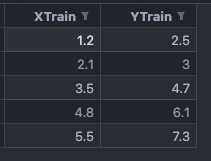
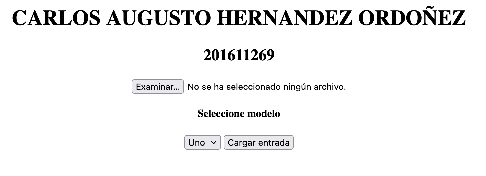
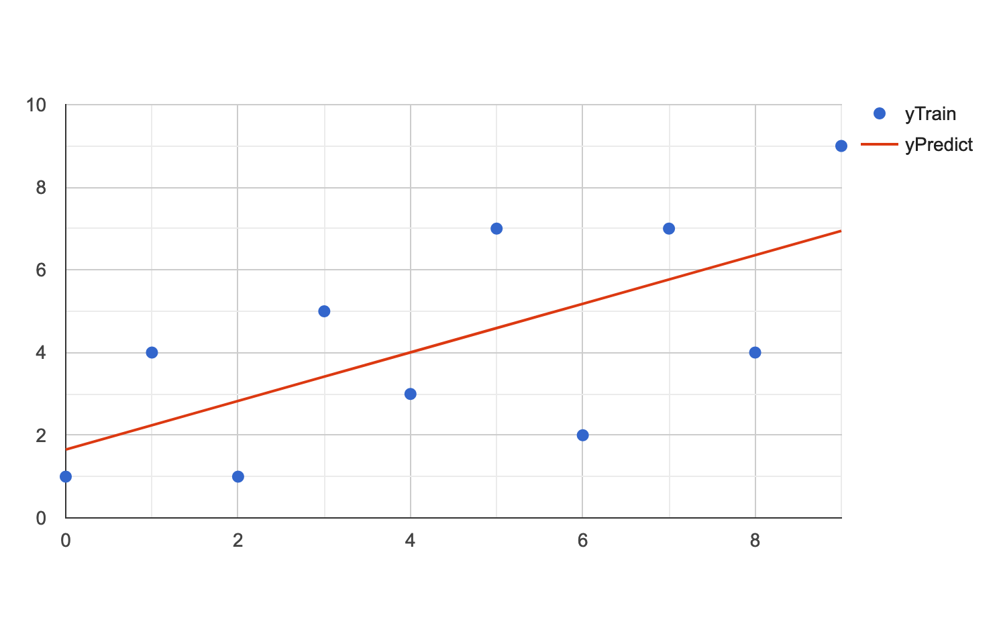

### UNIVERSIDAD SAN CARLOS DE GUATEMALA

### FACULTAD DE INGENIERIA

### ESCUELA DE CIENCIAS Y SISTEMAS

### INTELIGENCIA ARTIFICIAL 1

### MANUAL TECNICO

- CARLOS AUGUSTO HERNANDEZ ORDOÑEZ - 201611269

## Indice
### Introducción
### Objetivos
### Problema
### Solución
### Conclusiones
### Recomendaciones
### Referencias

# INTRODUCCIÓN

Este proyecto tiene como objetivo crear un sitio web interactivo que permita a los usuarios practicar y experimentar con algoritmos de Machine Learning, mediante la selección de archivos de entrada y modelos de aprendizaje automático. Se ha diseñado usando HTML y JavaScript, con la ayuda de GitHub Pages para su despliegue. Utilizando la biblioteca **tytus.js**, el sitio permite a los usuarios ajustar parámetros de los modelos, entrenarlos con diferentes conjuntos de datos, y observar los resultados de predicción en tiempo real.

# Objetivos

Aplicando los conocimientos adquiridos a nivel teorico, a través de una librería que cumple con los requisitos y simplemente con uso de esas herramientas poder mostrar la información correspondiente. Teniendo en caso elementos fijos.

## Objetivos especificos

- Implementar una interfaz web que permita la selección de archivos de datos en formato CSV y de diferentes modelos de Machine Learning.
- Facilitar la parametrización de modelos mediante controles intuitivos para ajustar el porcentaje de datos de entrenamiento y prueba, definir el objetivo de entrenamiento, y establecer parámetros específicos para cada tipo de modelo.
- Proveer herramientas de visualización para mostrar resultados de entrenamiento y predicción, así como gráficos que faciliten la interpretación de los datos y del modelo.
- Promover el aprendizaje de conceptos de Machine Learning a través de una plataforma accesible que utiliza tecnologías web como GitHub Pages, JavaScript y HTML.

# problema

Se tiene como inconveniente que los ejemplos de la librería, son estáticos por lo que puede ser necesario de un archivo con valores dinámicos, estos son resueltos a traves de CSV, que es un estandar, con ello y una estructura fija, más valores cambiantes se tiene como resultado los elementos, considerados en el entorno establecido.

Con el siguiente ejemplo de un registro lineal, será esencial para poderlo visualizar

Con este elemento tenemos como objeto obtener algunos valores de tipo X y Y y con ello utilizar la prediccón

# solución

Se cuenta con una interfaz amigable y existe en el entorno correspondiente, lo que lleva con ello punto de facilidad de uso. en este caso al seleccionar un archivo de ejemplo.

- Botón "Examinar...": Este botón permite al usuario seleccionar un archivo desde su dispositivo.
- Mensaje de estado: "No se ha seleccionado ningún archivo." Indica que el usuario aún no ha seleccionado un archivo.
- Menú desplegable "Seleccione modelo": Este menú probablemente ofrece diferentes opciones de modelos o configuraciones que el usuario puede elegir. La única opción visible es "Uno", pero podría haber más disponibles al desplegar el menú.
- Botón "Cargar entrada": Este botón inicia el proceso de carga del archivo seleccionado y, posiblemente, de la configuración del modelo.

Podemos obtener un resultado como el siguiente.

# Conclusiones

  -  Entendimiento de la manipulación de datos: La implementación del selector de archivos y su procesamiento permitió comprender cómo preparar datos para modelos de Machine Learning en un entorno web.
  -  Aprendizaje sobre la parametrización de algoritmos: La integración de opciones de configuración para cada modelo reveló la importancia de ajustar adecuadamente los parámetros para mejorar la precisión de los modelos.
  -  Uso efectivo de la visualización: Los gráficos implementados ayudaron a que los resultados fueran comprensibles y accesibles, demostrando la importancia de la visualización para evaluar el desempeño del modelo.
  -  Despliegue en la web: Usar GitHub Pages facilitó el despliegue del sitio, permitiendo una plataforma abierta y accesible para experimentar con Machine Learning.

# Recomendaciones

  -  Ampliar la biblioteca de modelos: Incluir más algoritmos de Machine Learning podría enriquecer la experiencia del usuario y proporcionar una perspectiva más amplia de las opciones disponibles.
  -  Mejorar la interfaz de usuario: Incluir guías interactivas o ejemplos de uso en la interfaz ayudaría a usuarios principiantes a comprender mejor cómo configurar y ejecutar los modelos.
  -  Optimizar la visualización de gráficos: Integrar opciones para personalizar los gráficos o cambiar el tipo de visualización puede hacer que la interpretación de los datos sea más intuitiva y precisa.
  -  Agregar validación de datos: Implementar validaciones en los archivos de entrada y en los parámetros del modelo podría evitar errores comunes y mejorar la experiencia de usuario.

# Bibliografía

- Librería tytus, [Tytus](https://github.com/tytusdb/tytusjs)